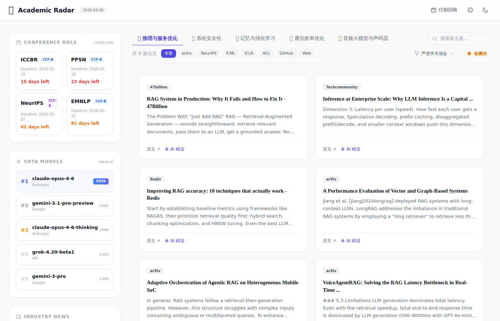
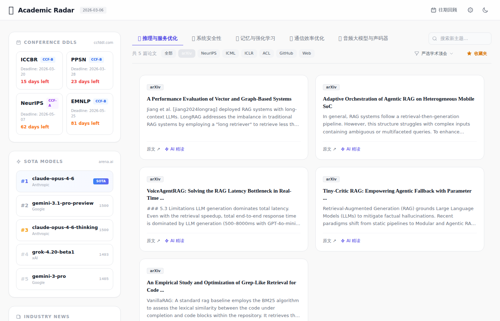
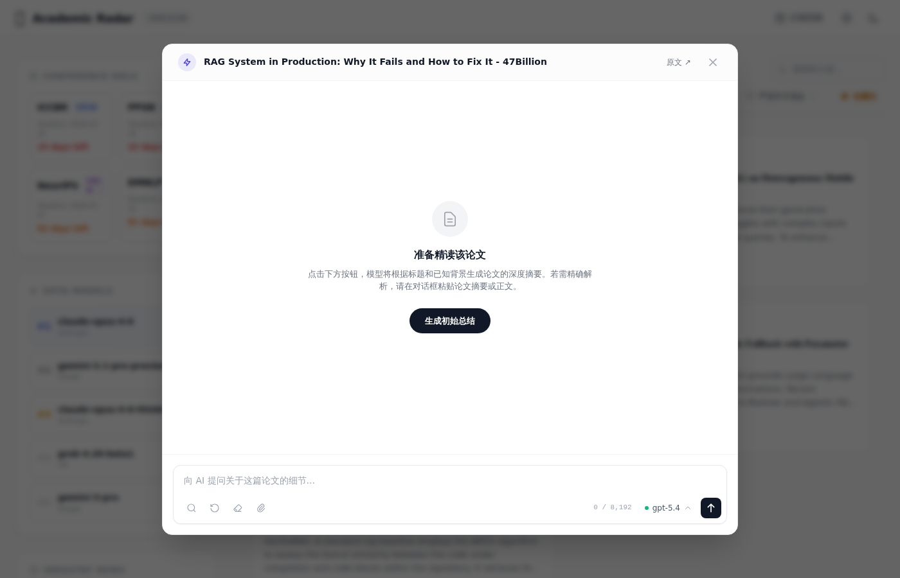
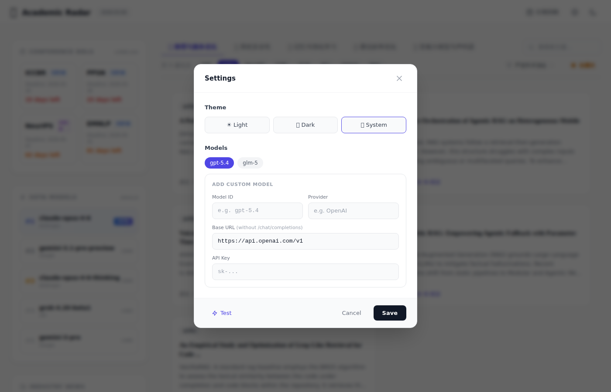

# 做了一个 AI 论文雷达，顺便把每日顶会论文都收进来了

> 适合发在 linux.do 等技术社区的博文，Markdown 格式，含图片占位符。发布前请运行 `python scripts/capture_screenshots.py`（需先启动服务）生成截图，并将图片上传至图床后替换下方链接。

---

做 AI 方向的研究，每天刷 arXiv、顶会、各种博客，信息太散了。之前试过 RSS、邮件订阅，要么延迟高，要么分类不细。后来发现 Tavily 的搜索 API 支持按站点限定，就想着能不能搭一个「论文雷达」，把几个主流来源聚合起来，再配上 AI 精读，省得自己一篇篇翻。

于是就有了 OpenClaw Academic Radar。

## 长什么样

主界面分三块：左侧是会议 DDL、SOTA 模型排行、行业资讯；中间是论文卡片，按主题 Tab 切换；右侧有搜索和筛选。



默认是「严选学术顶会」模式，只搜 arXiv、NeurIPS、ICML、ICLR、ACL 这几个站。想看点博客、GitHub 项目之类的，可以切到「泛科技检索」。最近加了按来源标签筛选，比如只看 arXiv 的，点一下就行。



## 发现更多：别乱切信息源

之前有个「发现更多优质内容」的按钮，一点就自动切到泛科技检索，结果学术顶会的内容全没了，挺坑的。现在改成：**保持当前信息源**，只是多拉一批结果（最多 20 篇）。你在学术模式就继续学术，在泛科技就继续泛科技。

## AI 精读

点卡片上的「AI 精读」会弹出一个对话窗口，可以：

- 让模型根据标题和链接生成初始总结
- 开启 Web Search 后，会先用 Playwright 抓取页面正文，再喂给模型，比纯标题靠谱不少
- 支持粘贴摘要、上传 txt/md 文件，或者贴图片（PDF 二进制读不了，会提示你给链接或手动粘贴）



模型支持 gpt-5.4、glm-5，也可以自己加自定义模型。设置里有个「Test」按钮，可以测一下 API 是否连通。



## 技术栈

- 后端：Flask + Tavily API + OpenAI 兼容接口
- 前端：Tailwind CSS + 原生 JS，无框架
- Web 抓取：Python Playwright（和 Node 的 `npx playwright install` 共用浏览器缓存，装过一次就行）
- 部署：GitHub Actions 每天跑一次，生成 HTML 推到 GitHub Pages

## 本地跑起来

```bash
git clone https://github.com/shenhao-stu/openclaw-academic-radar.git
cd openclaw-academic-radar
pip install -r requirements.txt
python -m playwright install chromium

# 配置 .env 里的 TAVILY_API_KEY，以及 LLM 的 key（如果要精读）
python daily_ai_brief.py      # 生成日报
python daily_brief_server.py  # 起服务，默认 8081
```

主题、话题、模型都可以在页面上改。话题还支持环境变量 `RADAR_TOPICS`，格式是 `中文标签|英文查询;...`，方便在 CI 里自定义。

## 踩过的坑

1. **Tavily 的 max_results 上限 20**：想分页的话得自己拼多组查询，暂时没做，直接拉满 20 条。
2. **Playwright**：Python 和 Node 各有一套，但浏览器装一次两边都能用。GitHub Actions 里要显式 `python -m playwright install chromium`。
3. **PDF 上传**：前端读不了 PDF 二进制，只能提示用户给链接或粘贴文本。图片用 base64 塞进对话里，模型能看。

## 仓库

[https://github.com/shenhao-stu/openclaw-academic-radar](https://github.com/shenhao-stu/openclaw-academic-radar)

欢迎提 issue 和 PR。如果对你有用，点个 star 就行。
